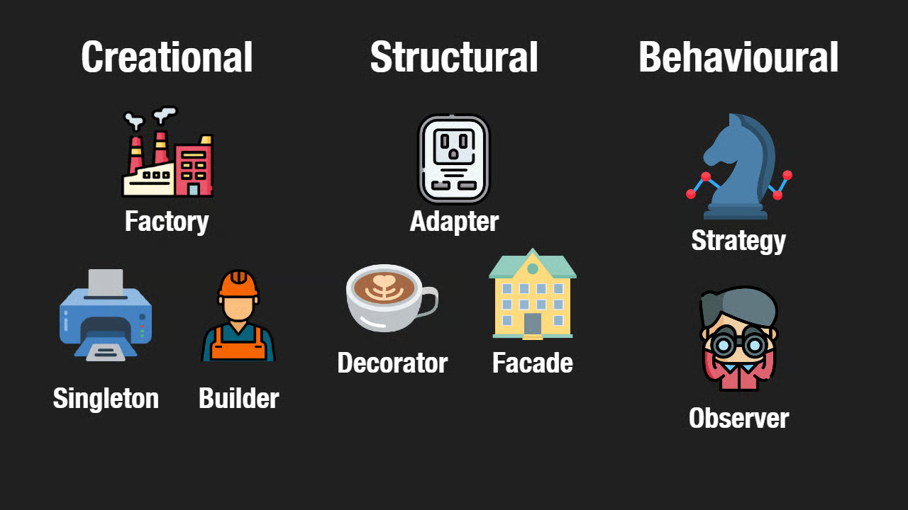

## Understanding Design Patterns Through Everyday Systems

As I built out the project, I realized patterns appear in our WarriorHub website project, even in places we interact with every day. Design patterns aren’t strict rules; they’re more like familiar structures that help software stay organized and predictable. Seeing them show up in the code made the project feel less like writing isolated components and more like arranging a coordinated system.

## Structural Patterns: A Restaurant with Clear Roles

One pattern that became especially clear was structural architecture, the idea of separating a system into distinct layers. The best way I can describe it is through a restaurant. In a good restaurant, the dining room, kitchen, and storage areas each have their own responsibilities. The dining room is where customers interact and place orders, the kitchen interprets those orders and prepares the meals, and the storage area supplies everything needed behind the scenes. WarriorHub follows the same idea. React components form the “dining room” that users see and interact with. Next.js API routes act like the kitchen staff, taking requests and handling the logic. Prisma and PostgreSQL hold all the application data the way a storage room holds ingredients. The system stays organized precisely because these layers don’t mix. Just as customers shouldn’t wander into the kitchen, the UI never touches the database directly. This separation is what makes the overall structure stable and easier to maintain.

## Behavioral Patterns: React as a System of Sensors

Another pattern I noticed falls under **behavioral design**, where different parts of the system respond to changes. React behaves a lot like a network of sensors in a modern building. Motion sensors turn on the lights when someone enters a room, thermostats adjust to temperature changes, and automatic doors open without anyone needing to push a button. Similarly, React uses `useState` to store information that can change and `useEffect` to “watch” those changes. When the user switches the calendar month, WarriorHub automatically fetches new events. When someone types into the search bar, the event list updates instantly. When a session changes, the “My Events” page reloads the correct data. Even image previews update the moment a new URL is entered. The UI reacts automatically to the system’s internal state, just like a building adjusts to changes through its sensors. This observer-like behavior makes the interface feel alive and responsive.

## Behavioral Patterns: Gatekeeping Through Authorization

The third major pattern in WarriorHub is also behavioral, but in a different direction: **policy and gatekeeping logic**. This is the part of the system that decides who is allowed to do what, similar to how certain rooms in a building require keycards or how restaurants restrict kitchen access to staff only. WarriorHub checks a user’s role and identity before allowing edits or deletions. Only the event creator or an admin can modify certain data, and some pages require a logged-in session before loading at all. This gatekeeping pattern keeps the application safe and prevents unauthorized changes, ensuring that users only interact with what they’re permitted to access.

## Seeing the Architecture Behind the App

Recognizing these patterns helped me appreciate WarriorHub not just as a collection of pages and components, but as a coordinated system shaped by structure and behavior. The layered architecture keeps everything organized, the state-driven updates make the interface responsive, and the authorization checks protect the integrity of the data. These patterns aren’t just theoretical concepts. They’re the hidden architecture that makes the project work smoothly and predictably.

*Attribution: I used ChatGPT to help refine the organization, metaphors, and grammar of this essay.*
