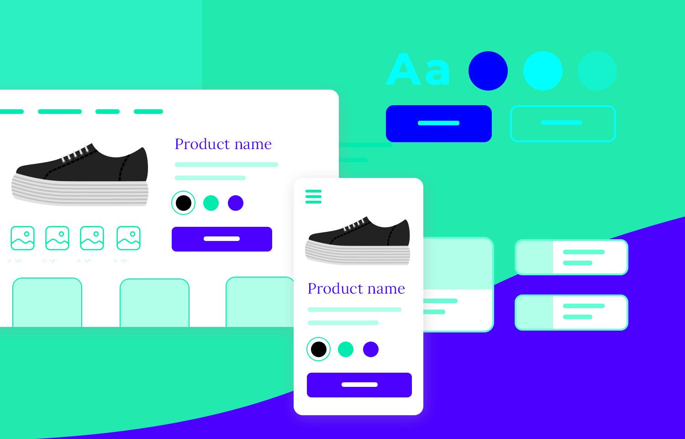

## Why I Enjoy Creating with UI Frameworks

I actually enjoy creating with UI frameworks. There’s something about designing an interface that feels like a blend between engineering and art. Every button, color, and layout choice reflects both logic and creativity. It’s not just about coding—it’s about crafting an experience.  

In the past, I used to think web development was all about typing HTML and CSS by hand. But after learning Bootstrap 5, I realized how much faster and more efficient it can be to use frameworks. Instead of spending hours fixing layout bugs, I can focus on what matters most: making the design look clean, modern, and responsive.

## Why Use Frameworks Like Bootstrap?

Frameworks like **Bootstrap 5** give developers a solid foundation. They come with pre-built components—grids, buttons, navigation bars, and responsive design features—that help me design professional-looking websites without reinventing the wheel.  

It’s similar to using well-designed building blocks: you still control the overall structure and style, but you can build faster and more confidently. I also appreciate how Bootstrap helps me maintain consistency across devices. Whether someone opens my site on a phone or laptop, everything adjusts automatically.

## Tools That Make UI Development Easier

We’re lucky to live in a time where so many tools make web development smoother.  
Extensions in **VS Code**, like Live Server, Prettier, and Bootstrap snippets, make front-end coding less frustrating and more fun.  

Even AI tools can help—whether by explaining documentation faster, helping debug, or generating sample layouts. Instead of replacing my creativity, they actually give me more time to focus on design and problem solving.

## UI Design as Art and Future Potential

Designing user interfaces feels artistic to me. It’s like composing visual music—balancing colors, alignment, and spacing until everything feels right.  

At the same time, UI skills are incredibly useful for the future. Whether I build a personal portfolio, a robotics project website, or even start a small business, knowing how to design intuitive interfaces helps me communicate ideas effectively to the world.

## Reflections on Learning Bootstrap 5

Learning Bootstrap 5 taught me that frameworks aren’t shortcuts—they’re the product of years of collective developer experience. Using them helps me understand best practices in layout and accessibility while still giving me room to personalize my work.  

I now see web design not just as a technical task, but as a creative craft. UI frameworks give structure to creativity—they let us express ideas efficiently and beautifully.

## AI Assistance

I used ChatGPT to help me refine the grammar, organization, and formatting of this essay. All the thoughts, reflections, and tone are my own.
