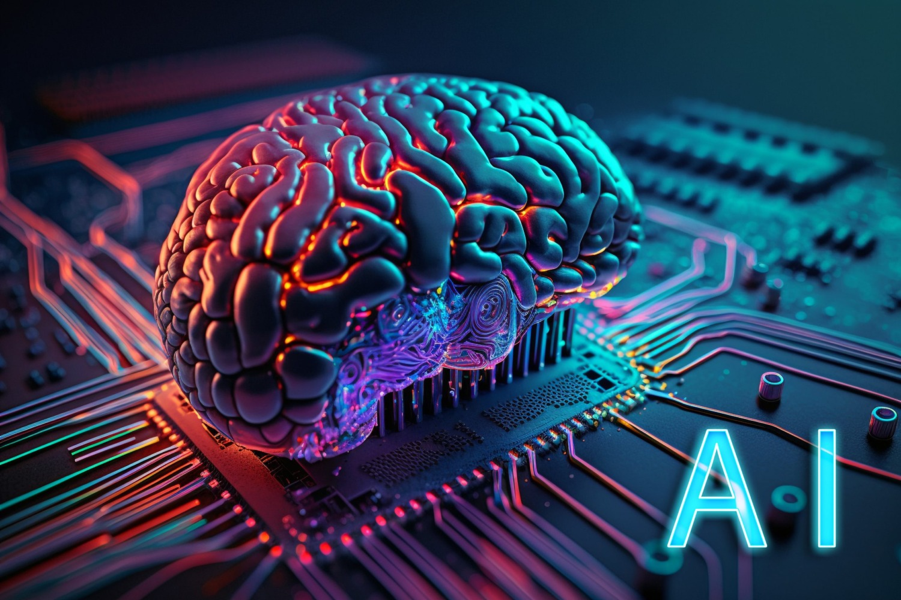

When I first started ICS 314, I used AI very sparingly during WODs. At the time, I wanted to rely on my own reasoning and fully understand the material without external assistance. However, as the course progressed, the pace increased significantly, and I found it difficult to consistently meet the strict time limits of the WODs. Eventually, I began using AI more regularly, both for WODs and for the final project, as a practical way to keep up with the workload.

## In the context of learning

Using AI effectively required understanding what was happening in the code rather than blindly accepting generated results. I learned that AI does not work well with vague instructions. To get useful output, I had to clearly understand the task and provide specific implementation details. In this sense, AI did not replace learning; instead, it exposed gaps in my understanding when I was unable to explain what I wanted. When AI responses were incorrect or incomplete, I had to analyze the code manually, which reinforced my understanding of the underlying concepts.

## In the context of software engineering

From a software engineering perspective, using AI felt less like outsourcing work and more like guiding another programmer. AI could generate code quickly, but I was responsible for directing the approach, validating correctness, debugging errors, and integrating the result into the existing codebase. AI was particularly weak at debugging complex issues; while it could suggest possible causes, I still had to trace errors manually and determine the root problem. This experience emphasized that AI can accelerate development, but only when paired with careful oversight and technical judgment.

## In the context of athletic software engineering

The WOD structure of ICS 314 mirrors athletic training, where speed, repetition, and pressure are intentionally built into the learning process. Initially, I resisted using AI because I felt it conflicted with the goal of skill-building. Over time, I realized that using AI strategically was similar to using training tools in athletics—it does not eliminate effort, but it allows you to train at a higher intensity. Even with AI, I still had to think, decide, and debug under time pressure, which helped me develop both speed and confidence as a programmer.

## Final thoughts

My experience in ICS 314 taught me that AI is not a shortcut to understanding, but a tool that amplifies the programmer’s intent. Without understanding the problem, AI produces poor results. When used responsibly, however, it can significantly improve productivity while still reinforcing core software engineering skills. Moving forward, I see AI as a programming partner—one that requires clear direction, critical evaluation, and human judgment to be effective.

---

*Attribution: I wrote this essay myself. I used ChatGPT to help refine technical wording and reorganize sentences for clarity.*
