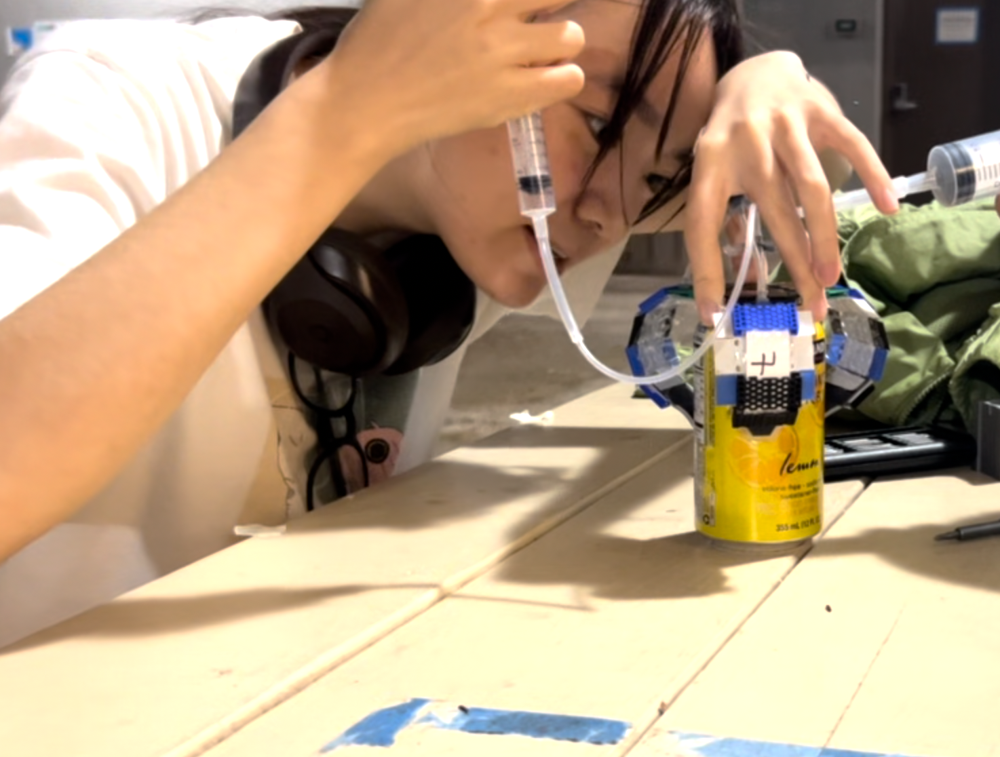
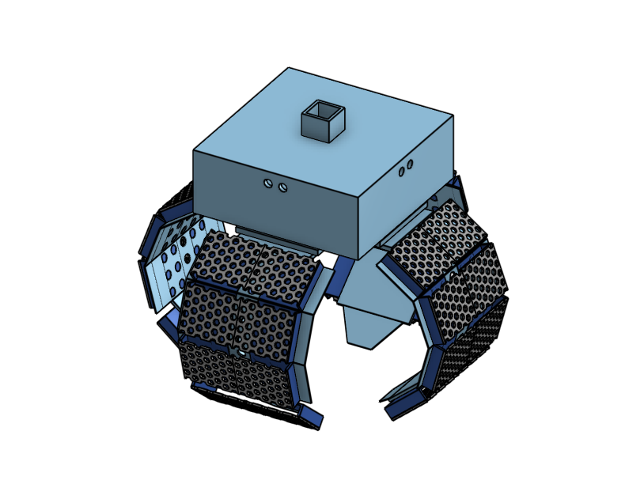

  
  
  

The **Jellyfish-Inspired Underwater Robot** was developed by a **five-person team** in the Soft Robotics and Intelligent Machines Laboratory (SAIL). The goal of the project was to design a compact, multifunctional underwater robotic system capable of gentle propulsion, compliant grasping, and environmental interaction while minimizing disturbance to marine life. The system integrates soft pneumatic actuators with modular mechanical and electronic components to support underwater exploration and manipulation tasks.

My primary contribution to this project was the **design, fabrication, and iterative refinement of the soft robotic gripper**. I spent the majority of my time developing the gripper mechanism through multiple design iterations, focusing on improving grasp reliability, durability, and compliance. This work involved CAD modeling of gripper components, fabrication using 3D printing and soft material processes, and repeated physical testing to evaluate performance when interacting with objects of different shapes and stiffness. Through these iterations, I explored trade-offs between flexibility and load capacity and refined the design to achieve more consistent and gentle grasping behavior.

In addition to the mechanical work, I also contributed to the **software and control integration** of the system. I worked with **ROS2** to connect a joystick-based human interface to the robot’s control pipeline, enabling manual operation of the gripper and actuators. This involved wiring ROS2 nodes to communicate with an Arduino microcontroller, translating joystick inputs into servo commands for the gripper mechanism. This work provided hands-on experience with integrating high-level robotic middleware with low-level embedded control systems.

Through this project, I learned how soft robotic systems require close coordination between mechanical design, material selection, and control strategies. Iterative prototyping was essential, as small design changes could significantly affect performance underwater. Working across both hardware and software also reinforced the importance of clear interfaces between subsystems, especially in a team setting. Overall, this project strengthened my ability to contribute meaningfully to multidisciplinary robotic systems and deepened my interest in soft robotics for real-world environmental applications.

---

*Attribution: I used ChatGPT to help refine technical wording and improve clarity.*
