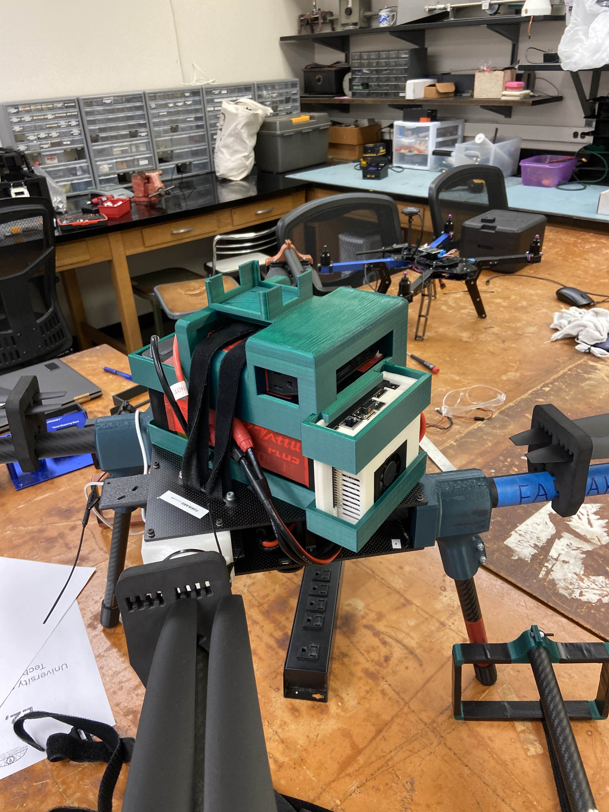

  
  

The **UH Drone Technologies (UHDT)** project is a multidisciplinary team effort organized into several subsystems, including hardware, air delivery, software, and image processing. The overall goal of the team is to design, build, and test unmanned aerial vehicles (UAVs) for autonomous flight and competition scenarios. Over multiple semesters, I contributed to different subsystems, gaining experience across mechanical design, actuation, and robotic software integration.

I initially worked in the **air delivery subsystem**, where I helped develop a simple payload release mechanism for a drone competition. My contribution focused on designing and implementing a **servo-driven mechanism that translated rotational motion into linear motion** to unwind a spool and release an object mid-flight. This required balancing simplicity, reliability, and weight constraints. Through this work, I learned how mechanical actuation decisions directly affect system reliability, especially in aerial platforms where failure modes are difficult to recover from once airborne.

I later transitioned to the **hardware subsystem**, where I focused on **CAD design and fabrication of drone components**. Using Onshape, I designed modular components such as mounting structures and landing gear, accounting for manufacturing constraints imposed by FDM 3D printing. I explored different materials, including TPU and PETG, to balance flexibility, durability, and stiffness. Iterative prototyping and physical testing helped identify trade-offs between shock absorption and structural stability, reinforcing the importance of material selection and real-world testing in mechanical design.

During the most recent semester, I worked in the **software subsystem**, where my focus shifted to simulation and autonomy. I worked on integrating **ROS2 with the ArduPilot flight controller and the Gazebo simulation environment** to simulate drone flight behavior. My goal was to enable testing of obstacle avoidance algorithms in simulation before deployment on physical hardware. This involved wiring communication between ROS2 nodes, the flight controller, and the simulated environment, as well as debugging issues related to synchronization, coordinate frames, and sensor modeling. Through this work, I learned how complex robotic systems rely on tightly coupled software components and how simulation can be a powerful tool for testing autonomy while reducing risk to physical hardware.

Overall, this project taught me how large engineering systems are built through collaboration across specialized subsystems. Moving between air delivery, hardware, and software roles gave me a systems-level perspective on UAV development and highlighted the importance of clear interfaces between mechanical design, control software, and simulation. This experience strengthened my ability to work across disciplines and adapt to different technical challenges within a single complex system.
