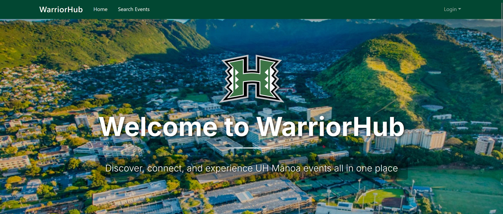
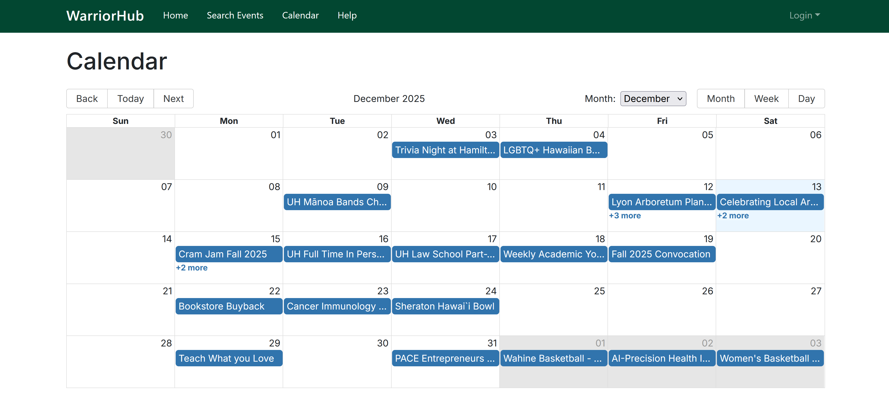

  
  

**WarriorHub** is a centralized event discovery and scheduling platform designed for students at the University of Hawaiʻi at Mānoa. The purpose of the application is to address the fragmentation of campus event information across multiple independent calendars by providing a single, searchable system for discovering, managing, and tracking events. The platform supports three roles—users, organizers, and administrators—each with different permissions and responsibilities. The project was developed by a five-person team as part of ICS 314 using **Issue Driven Project Management (IDPM)**.

My primary role on the team was **backend development**, with additional responsibility for routing, data consistency, and system-level fixes. I completed my work through clearly scoped GitHub issues and feature branches, following IDPM practices and ensuring each contribution was independently reviewable and testable.

One major contribution was **rebuilding the user home page to be fully data-driven**. I removed hardcoded content and replaced it with real event data fetched from the backend API. Featured events are retrieved from `/api/events`, mapped into a responsive grid using a shared `EventCard` component, and include full details such as title, date, location, organization, categories, and images. I also integrated the heart-based “interested” functionality, wiring the UI to `/api/events/[id]/like` so signed-in users can mark events they care about. This work required careful coordination between frontend components, API routes, and authentication state.

I also implemented several **core backend features related to event management**. This included creating the dynamic event details route at `/events/[id]`, implementing full event creation functionality, and adding server-side validation to prevent invalid or unauthorized requests. Events are created exclusively through authenticated API routes using Prisma, with IDs generated server-side to prevent client manipulation. I added robust error handling so the API returns meaningful status codes, and the UI displays clear feedback to users.

A significant engineering challenge I addressed was **time consistency across the entire application**. I identified and fixed inconsistencies caused by mixed time handling by establishing a single rule: all timestamps are stored in UTC and displayed in Honolulu time (HST). I implemented shared time utility functions to handle formatting and conversions and updated all relevant pages—including the landing page, user home, search, calendar, event details, and admin views—to use these helpers. Forms were updated to convert local HST input into UTC before saving and convert stored UTC values back into HST for editing. This eliminated subtle bugs and ensured consistent behavior across the system.

In addition, I worked on **routing and role-based navigation fixes**, such as ensuring admin role updates properly redirect and refresh state after submission. I also implemented the organizer “Add Event” workflow, including role gating so only authorized users can create events, validation to prevent events from being created in the past, and image URL validation with graceful fallbacks when images fail to load. I contributed the full **calendar feature**, implementing a reusable calendar view that supports month, week, and day layouts, dynamic routing by year and month, and clickable events that link directly to their detail pages.

Through this project, I gained hands-on experience with **real-world software engineering concerns**, including data integrity, time handling, API validation, routing correctness, and collaborative development in a shared codebase. WarriorHub reinforced that building reliable software is not just about adding features, but about enforcing consistency, anticipating edge cases, and maintaining clear interfaces between systems. While the application is a web platform, the engineering principles practiced—modularity, validation, version control, and incremental development—are broadly applicable beyond web development.

---

*Attribution: I used ChatGPT to help refine technical wording and improve clarity.*
