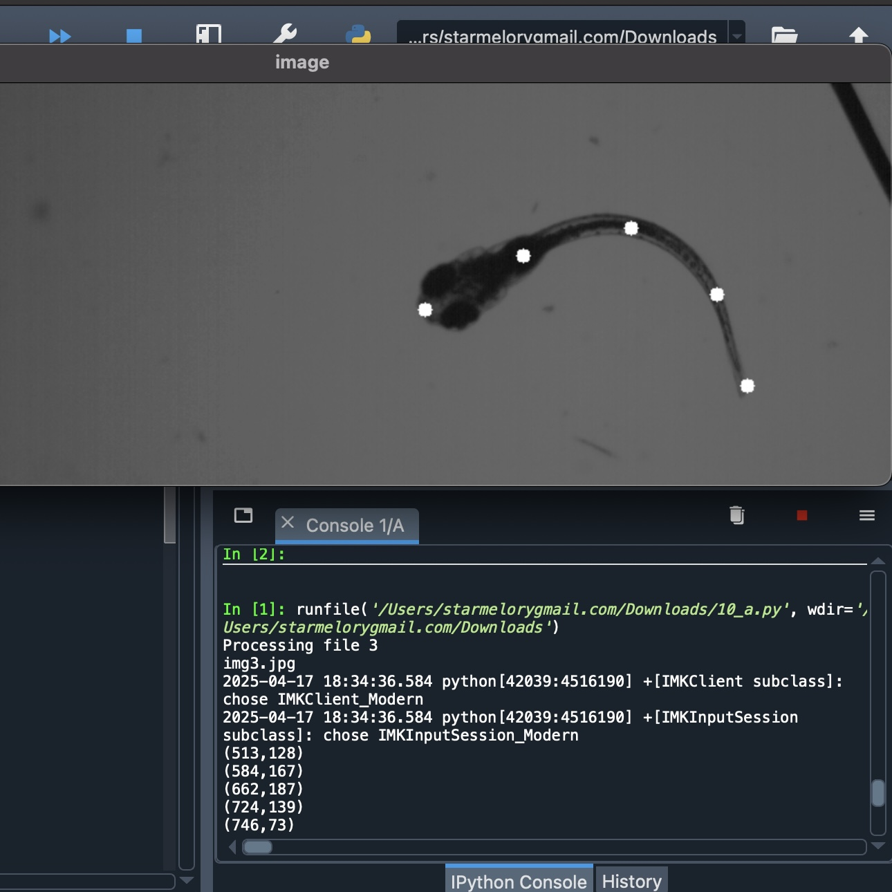

  
  
  

This project focused on quantifying swimming mechanics of undulatory swimmers (e.g., larval fish and soft robots) to support efficient robot design.  

- **Body Shape Extraction:** Tracked body midlines by marking points from head to tail.  
- **Curve Generation:** Converted points into smooth curves using interpolation.  
- **Movement Analysis:** Measured head angle and swimming speed to evaluate movement efficiency.  
- **Data Visualization:** Generated plots comparing body shapes and trajectories.  

**Tools:** Python, OpenCV, SciPy, Matplotlib.  

The analysis provided insights into locomotion strategies that informed the development of **energy-efficient underwater robots**.
