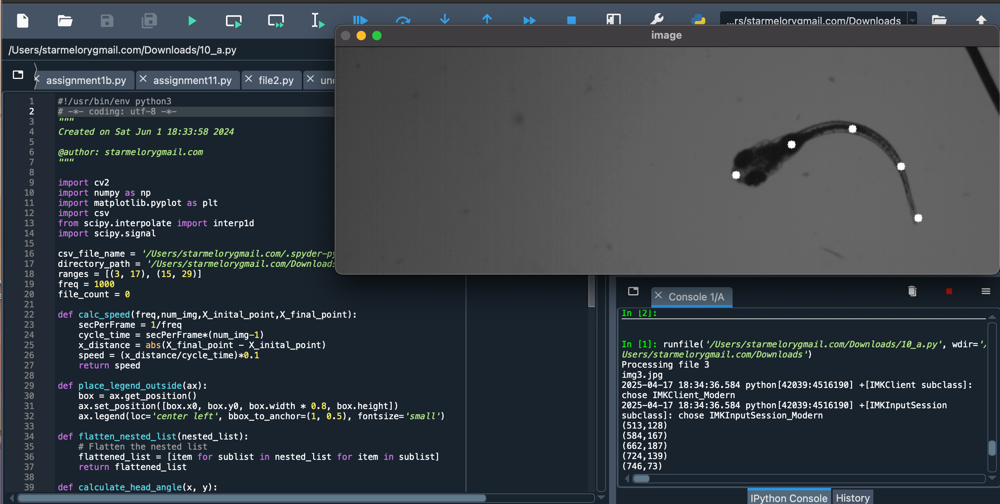

  
  
  

This **individual project** focused on quantitatively analyzing the swimming mechanics of undulatory swimmers, such as larval fish and soft robotic systems, with the goal of informing the design of more energy-efficient bio-inspired robots. The project required independently designing and implementing the full analysis workflow, from raw video processing to final data visualization.

My primary contribution was the development of a **Python-based image processing and kinematic analysis pipeline** to extract swimming motion from video data. Using OpenCV, I processed image sequences to identify and track points along the body midline from head to tail. These discrete points were converted into smooth continuous curves through interpolation, enabling consistent representation of body shape across time and serving as the foundation for further analysis.

Building on the extracted midlines, I implemented analysis routines to quantify **movement characteristics** such as head angle variation and swimming speed. These metrics enabled comparisons across different swimming motions and provided insight into how body deformation patterns influence propulsion efficiency. I also developed visualization tools using Matplotlib to compare trajectories, body shapes, and kinematic parameters, making trends and differences easier to interpret.

Through this project, I learned how image processing, numerical analysis, and data visualization can be integrated into a cohesive computational workflow. Translating noisy visual data into meaningful quantitative measurements required careful algorithm design, parameter tuning, and validation. This experience strengthened my ability to independently design data-driven analysis tools and reinforced the role of computational methods in guiding the development of **bio-inspired and energy-efficient robotic systems**.

---

*Attribution: I used ChatGPT to help refine technical wording and improve clarity.*
